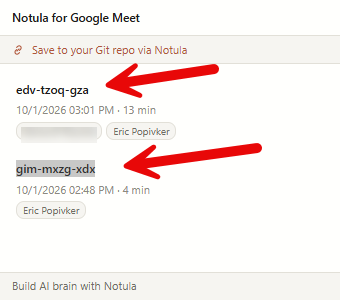

# Todo Items

## Planned

- [ ] Show the name of the meeting instead of the unique id like `gim-mxzg-xdx`
  - In the meetings list a call is titled with its Meet code unless it was renamed by hand, which makes meetings hard to tell apart

  

- [ ] Name saved transcript files like `Transcript - Entech Daily Meeting 1 - 2026-04-23 14-23.md`
  - Format is `Transcript - <meeting title> - <YYYY>-<MM>-<DD> <HH>-<mm>.md`, so files group by meeting and sort by date within it

- [ ] Save the transcript as text instead of Markdown
  - Export and download currently produce a `.md` file; make plain text (`.txt`) the saved format
  - Decide whether Markdown stays as an option, and whether Copy follows the same format; the file-naming item above then ends in `.txt`

- [ ] New icon and colours
  - The current icon is the same as the published "Notula for Google Meet" one, so the two would be confused
  - Draw a few simple SVG candidates, compare them at toolbar size (16px) and store size (128px), and avoid anything resembling Google Meet's logo or colours
  - Needed before the first Chrome Web Store release

- [ ] Rewrite the website pages, privacy policy and store listing for Simple Transcript
  - The rebrand deleted the old website pages (redirects to notula.org) and the screenshot tooling, and only trimmed `WEBSTORE_LISTING.md`
  - Write a home page and a privacy policy, publish them with GitHub Pages, finish the listing text and make new screenshots and tiles
  - Needed before the first Chrome Web Store release, once the UI is in its final shape

- [ ] Error logging and reporting for when captions are not coming through
  - A "Something's wrong?" action in the popup builds a diagnostic report (versions, channel names, message counts, errors) and opens a pre-filled GitHub issue, with a copy button as fallback
  - Enable Issues on the repo and add an issue template that tells users what to include
  - The report must not contain transcript text, participant names or meeting codes, and nothing is sent automatically

- [ ] Search across saved meetings
  - A search box above the meetings list filters by title, attendee name and transcript text
  - A match in the transcript shows the matching line under the meeting

- [ ] Capture real `captions_v2`, participant and chat messages for tests
  - Messages built from the structures documented in the code are not read by these parsers, so their content is untested
  - Record a few raw messages in a live call, rebuild their shape in `tests/helpers/samples.ts` with invented content, and add content tests
  - A suspected bug (v2 captions dropped at message number 128 or for long text) was not confirmed: a 43-minute call with 429 entries transcribed to the end. Re-check it against the real message shape

- [ ] Fix doubled words at the end of some transcript entries
  - Seen in a real export: "worst. worst.", "really. really.", "police police", "learns learns"
  - Likely from merging caption revisions in `transcript-store.ts`; reproduce before fixing

## Completed

- [x] Delete the leftover MeetScribe files (2026-10-05)
  - Removed `meetscribe/`, `meetscribe.zip`, `demo.html` and `seed-demo-data.js`; none was part of the build or the release package

- [x] Remove the language dropdown and take the caption language from Meet's own CC options (2026-10-05)
  - Dropdown removed from the floating panel; the transcript follows whatever language Meet's captions are set to
  - The extension no longer sets, re-sends or remembers a caption language, and no longer writes Meet's saved preference
  - `protobuf-encoder.ts` and `language-script.ts` deleted; the request to Meet that set the language is gone

- [x] Remove the Notes functionality (2026-10-05)
  - Notes section and the "Transcription" header removed from the floating panel; notes block removed from past meetings in both popups
  - Note messages, storage functions and types deleted; Markdown and text exports no longer have a notes block
  - A meeting is empty when it has no transcript lines; notes already in storage are left there, unread

- [x] Remove Notula from the branding and replace it with "Simple Transcript" (2026-10-05)
  - Named "Simple Transcript – Copy & Save for Google Meet"; "Simple Transcript" in the toolbar tooltip, panel title and popup header
  - Notula save feature, pairing screens, promo link and the only network code removed; five modules deleted
  - README, store listing text, release names and constitution updated; the notula.org redirect pages and the screenshot tooling deleted

- [x] Update Node from 22 to 24 (2026-10-02)
  - `release.yml`: `node-version: 24`; READMEs name Node 24
  - `package.json`: `packageManager` is `npm@11.19.0`, the npm that ships with Node 24

- [x] Make npm the unambiguous package manager (2026-10-02)
  - `package-lock.json` committed, `packageManager` field in `package.json`, stale `pnpm-lock.yaml` deleted
  - `release.yml`: installs with `npm ci`

- [x] Automated unit tests for the logic that does not need a browser (2026-10-02)
  - `tests/`: protobuf decoding, the `captions` parser, malformed input for every parser, the five export formats and export file naming, run with `npm test` (Vitest)
  - `src/utils/export-filename.ts`: file name shared by both popups
  - `release.yml`: runs the tests before the build
  - Content tests for `captions_v2`, participant and chat messages are deferred until real messages are captured; samples are built in code

- [x] If user opens up the same meeting at the same day, then proceed transcription in that meeting (2026-02-27)
  - `meeting-store.ts`: `findSameDayMeeting()` + `resumeMeeting()`
  - `transcript-store.ts`: `restoreEntries()` to reload live buffer with dedup maps
  - `service-worker.ts`: `ensureMeeting()` checks for same-day ended meetings before creating new ones

- [x] Renamed meeting is not saved (2026-02-27)
  - `floating-popup.ts`: Set `m.title = newTitle` in blur handler so subsequent operations use updated title

- [x] Display participants name in the meetings list (2026-02-27)
  - `floating-popup.ts`: Replaced description line with `.participant-tag` chips, removed participant count from meta

- [x] Move action buttons somewhere in the meeting card (2026-02-27)
  - `floating-popup.ts`: Moved `.meeting-item-actions` inside `.meeting-item-header`, right-aligned with `margin-left: auto`

- [x] If I open Live meeting transcription should also have back button like archived one (2026-02-27)
  - `floating-popup.ts`: Added `.back-nav` element with compact "Meetings" button, shown only in live view

- [x] It should open transcription when I click meeting card, not only meeting title (2026-02-27)
  - `floating-popup.ts`: Changed `contentEditable` check to use `getAttribute('contenteditable')` for reliable detection

- [x] If recording then icon in the list of extensions should indicate it otherwise it should be grayed with tooltip (2026-02-27)
  - `service-worker.ts`: `updateExtensionIcon(isRecording)` using OffscreenCanvas, called on start/stop/startup

- [x] I can click on extension and see all my meetings with a popup (2026-02-27)
  - `popup.html` + `src/popup/popup.ts`: standalone dark-themed meetings list
  - `service-worker.ts`: dynamic popup routing via `tabs.onActivated`/`onUpdated`
  - `rollup.config.mjs`: added IIFE build entry for `popup.ts`
